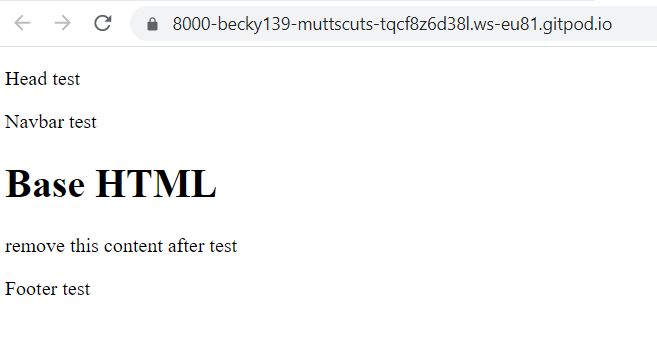

# Testing

A variety of manual and automated tests were performed throughout the project.

## Manual Testing

#1. Getting the live deployed site working. This is well documented in the latter sections of [DEPLOYMENT.md](DEPLOYMENT.md)

#2. Checking the deployed site opens on the homepage.
- create a function based view in home
- create a path in the url file in the home app
- reference the home app url in the main project url file

*home/views.py*
``` Python
def index(request):
    """
    Index view
    """
    return render(request, 'home/index.html')
```
*home/urls.py*
``` Python
path('', views.index, name='home'),
```
*main/urls.py*
``` Python
path('', include("home.urls")),
```



#3. Check own `css` and `js` files link up to `base.html` via `head.html` and `scripts.html`. These are component files that get inserted to `base.html` using Django Templates.


*static/css/style.css*
``` css
- body {
    background-color: greenyellow;
}
```

*referenced in templates/includes/head.html*
``` html
<link rel="stylesheet" href="" type="text/css">
```

*injected into base.html using*
``` Python
    
```


*static/js/script.js*
``` Javascript
console.log("Homepage")
```

*referenced into templates/includes/scripts.html*
``` html
<script src=""></script>
```

*injected to base.html using*
```html

```

The test is successful as the `body` has a greenyellow background colour and `Homepage` text is logged to the console in Chrome.


## Automated Testing

Return to[README.md](README.md)